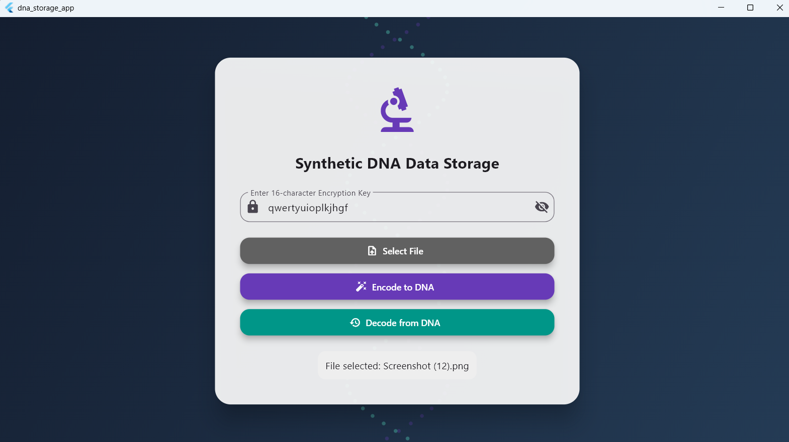

# Synthetic DNA Data Storage Encoder and Decoder

## Overview

Synthetic DNA Data Storage Encoder and Decoder is a desktop application that demonstrates how digital data can be converted into DNA sequences and later reconstructed back into the original file.

The system uses compression, AES encryption, binary-to-DNA conversion, FASTA generation, and decoding techniques to simulate DNA-based data storage.

This project was developed as a B.Tech Computer Science mini project using Flutter for the frontend and Python Flask for the backend.

---

## Features

* Encode any file into DNA sequences
* Decode DNA sequences back into original files
* AES-128 Encryption for secure storage
* Data Compression before encoding
* FASTA File Generation
* Checksum Verification
* User-Friendly Desktop Interface
* Automatic Backend Startup

---

## Tech Stack

### Frontend

* Flutter
* Dart

### Backend

* Python
* Flask

### Security

* AES-128 Encryption

### Data Storage Format

* FASTA

### Platform

* Windows Desktop

---

## Project Architecture

User File
↓
Compression
↓
AES Encryption
↓
Binary Conversion
↓
DNA Encoding
↓
FASTA Generation
↓
DNA Storage

Reverse process is performed during decoding.

---

## Encoding Workflow

1. User selects a file.
2. User enters a 16-character encryption key.
3. File is compressed.
4. Data is encrypted using AES.
5. Binary data is converted into DNA sequences.
6. DNA sequences are stored in FASTA format.
7. Encoded FASTA file is generated.

---

## Decoding Workflow

1. User selects FASTA file.
2. User enters encryption key.
3. DNA sequences are extracted.
4. DNA is converted to binary.
5. Data is decrypted.
6. Data is decompressed.
7. Original file is restored.

---

## Folder Structure

backend/
├── encoder/
├── decoder/
├── utils/
└── app.py

frontend/
├── lib/
├── windows/
└── pubspec.yaml

---

## Future Scope

* Cloud-Based DNA Storage
* Mobile Application Version
* Error-Correction Coding
* Biological DNA Synthesis Integration
* AI-Based Sequence Optimization

---

## Authors

Arjun Roy
Daiva Rajeev
Arsha Maria Joji
Arfad A R

College of Engineering Perumon

---

## License

Educational and Research Purpose Only.

## Application Screenshot

